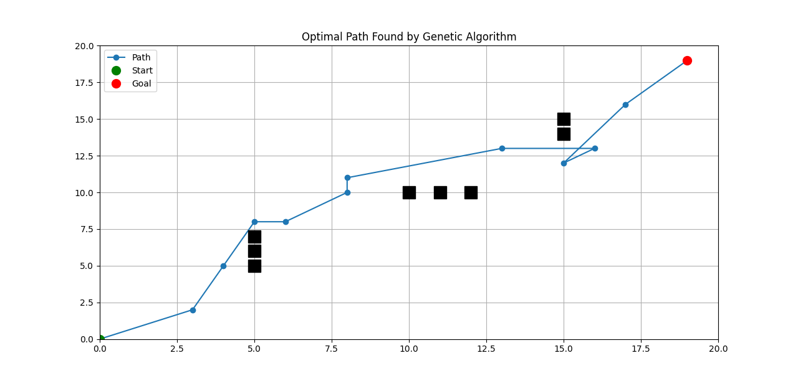
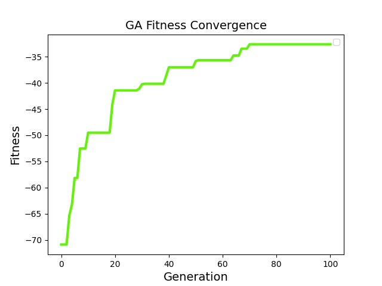

# Genetic Algorithm Path Planning on a Grid

This project uses a **Genetic Algorithm (GA)** (via [PyGAD](https://pygad.readthedocs.io)) to find an optimal path from a **start** to a **goal** position on a 2D grid while avoiding obstacles.

## 🚀 Features
- Configurable grid size (default: 20×20)
- Custom obstacles
- Waypoints automatically optimized by a GA
- Visualization of the path and obstacles using Matplotlib
- Fitness convergence plot across generations

## 📝 How It Works
- **Genes:** Each individual in the GA encodes the coordinates of intermediate waypoints.
- **Fitness:** Penalizes path length and collisions with obstacles.
- **Selection, Crossover, Mutation:** Handled by PyGAD to evolve better paths over time.

## 🖼 Example Output
| Optimal Path Found by GA | Fitness Convergence |
|--------------------------|---------------------|
|  |  |

*(Screenshots above show an example path and the GA fitness over generations.)*

## 🧩 Requirements
Install dependencies with:
```bash
pip install numpy pygad matplotlib
```
## 🧬 About the Genetic Algorithm

This project uses a **Genetic Algorithm (GA)** to evolve a path from the start to the goal.  
A GA is an optimization technique inspired by **natural selection** and **biological evolution**.

### How It Works
1. **Population:** Each individual (chromosome) encodes a list of waypoint coordinates.
2. **Fitness Function:** Penalizes path length and collisions with obstacles. Shorter, collision-free paths score higher.
3. **Selection:** The fittest individuals are chosen to reproduce.
4. **Crossover:** Parts of two parent paths are combined to create new paths (children).
5. **Mutation:** Randomly tweaks waypoint coordinates to introduce variety and help escape local optima.
6. **Generations:** Steps 2–5 repeat for many generations until the population converges to a good path.

### Why a GA?
- Works well for problems with a huge or complex search space where traditional methods struggle.
- Does not require gradients or derivatives.
- Can explore many different paths in parallel.

In this implementation:
- **Genes** = Each x or y coordinate of a waypoint.
- **Chromosome** = All waypoints (the whole path).
- **Fitness** = `- (path_length + 10 * collisions)`

PyGAD handles the selection, crossover, and mutation automatically, while the fitness function guides the evolution.

### 📝 License


---

Would you like me to **update your Python script** follow me...
